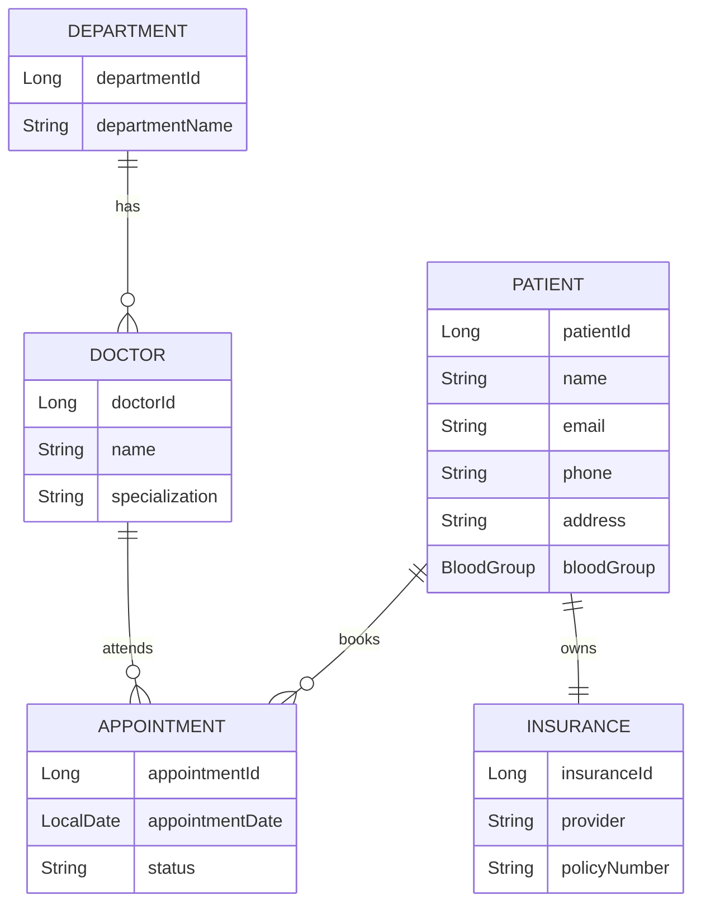

# 🏥 Hospital Management System (Spring Boot)

A ***Hospital Management System*** built using ***Spring Boot that manages patients, doctors, departments, appointments, and insurance details***.
The project follows a layered architecture using Controller, Service, Repository, and Entity layers.

#  🚀 Technologies Used 
    Java
    Spring Boot
    Spring Data JPA
    Hibernate 
    Maven
    MySQL / H2 Database
    REST APIs

# 📁 Project Structure

***Hospital_Management_System-Using-SpringBoot***

    │
    ├── src
    │   ├── main
    │   │   ├── java
    │   │   │   └── com.Hospital_Management_System.Hospital_Management_System
    │   │   │       ├── Contoller
    │   │   │       ├── Services
    │   │   │       ├── Repository
    │   │   │       ├── Entity
    │   │   │       ├── Dto
    │   │   │       ├── CustomException
    │   │   │       └── HospitalManagementSystemApplication.java
    │   │   └── resources
    │   │       ├── application.properties
    │   │       └── data.sql
    │   └── test
    │       └── HospitalManagementSystemApplicationTests.java
    │
    ├── pom.xml

    └── README.md

# ✨ Features

    Patient registration and management
    
    Doctor and department management
    
    Appointment booking
    
    Insurance details management
    
    RESTful API design
    
    DTO-based request/response handling
    
    Custom exception handling

# 🧩 Modules Overview

#👨‍⚕️ Patient Module

    Add and fetch patient details

    Prevent duplicate email registration

#📅 Appointment Module

    Book appointments
    
    Link patients with doctors

#🏥 Doctor & Department Module

    Manage doctors
    
    Assign doctors to departments

#🛡️ Insurance Module

    Store and retrieve patient insurance information

# 🗄️ Database ER Diagram

# ER Diagram Explanation

    1) A Patient can book multiple Appointments
    
    2) A Doctor can attend multiple Appointments
    
    3) Each Doctor belongs to one Department
    
    4) Each Patient can have one Insurance
    
    5) Appointment acts as a bridge between Patient and Doctor

