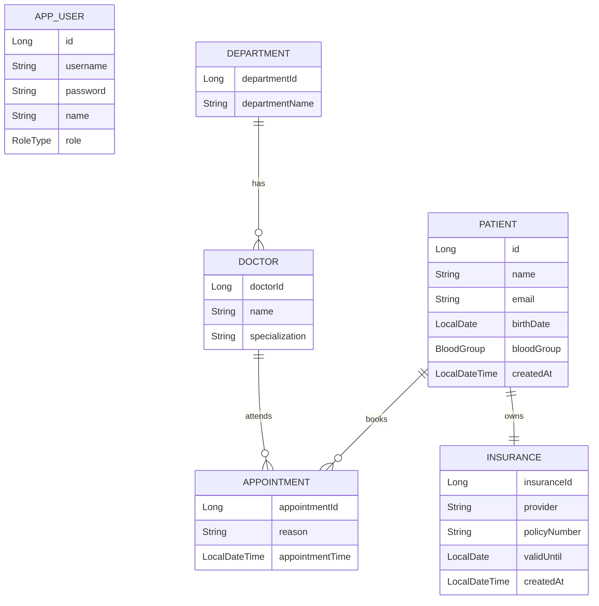

[//]: # (# 🏥 Hospital Management System &#40;Spring Boot&#41;)

[//]: # ()
[//]: # (A ***Hospital Management System*** built using ***Spring Boot that manages patients, doctors, departments, appointments, and insurance details***.)

[//]: # (The project follows a layered architecture using Controller, Service, Repository, and Entity layers.)

[//]: # ()
[//]: # (#  🚀 Technologies Used )

[//]: # (    Java)

[//]: # (    Spring Boot)

[//]: # (    Spring Data JPA)

[//]: # (    Hibernate )

[//]: # (    Maven)

[//]: # (    MySQL / H2 Database)

[//]: # (    REST APIs)

[//]: # ()
[//]: # (# 📁 Project Structure)

[//]: # ()
[//]: # (***Hospital_Management_System-Using-SpringBoot***)

[//]: # ()
[//]: # (    │)

[//]: # (    ├── src)

[//]: # (    │   ├── main)

[//]: # (    │   │   ├── java)

[//]: # (    │   │   │   └── com.Hospital_Management_System.Hospital_Management_System)

[//]: # (    │   │   │       ├── Contoller)

[//]: # (    │   │   │       ├── Services)

[//]: # (    │   │   │       ├── Repository)

[//]: # (    │   │   │       ├── Entity)

[//]: # (    │   │   │       ├── Dto)

[//]: # (    │   │   │       ├── CustomException)

[//]: # (    │   │   │       └── HospitalManagementSystemApplication.java)

[//]: # (    │   │   └── resources)

[//]: # (    │   │       ├── application.properties)

[//]: # (    │   │       └── data.sql)

[//]: # (    │   └── test)

[//]: # (    │       └── HospitalManagementSystemApplicationTests.java)

[//]: # (    │)

[//]: # (    ├── pom.xml)

[//]: # ()
[//]: # (    └── README.md)

[//]: # ()
[//]: # (# ✨ Features)

[//]: # ()
[//]: # (    Patient registration and management)

[//]: # (    )
[//]: # (    Doctor and department management)

[//]: # (    )
[//]: # (    Appointment booking)

[//]: # (    )
[//]: # (    Insurance details management)

[//]: # (    )
[//]: # (    RESTful API design)

[//]: # (    )
[//]: # (    DTO-based request/response handling)

[//]: # (    )
[//]: # (    Custom exception handling)

[//]: # ()
[//]: # (# 🧩 Modules Overview)

[//]: # ()
[//]: # (#👨‍⚕️ Patient Module)

[//]: # ()
[//]: # (    Add and fetch patient details)

[//]: # ()
[//]: # (    Prevent duplicate email registration)

[//]: # ()
[//]: # (#📅 Appointment Module)

[//]: # ()
[//]: # (    Book appointments)

[//]: # (    )
[//]: # (    Link patients with doctors)

[//]: # ()
[//]: # (#🏥 Doctor & Department Module)

[//]: # ()
[//]: # (    Manage doctors)

[//]: # (    )
[//]: # (    Assign doctors to departments)

[//]: # ()
[//]: # (#🛡️ Insurance Module)

[//]: # ()
[//]: # (    Store and retrieve patient insurance information)

[//]: # ()
[//]: # (# 🗄️ Database ER Diagram)

[//]: # ()
[//]: # (```mermaid)

[//]: # (erDiagram)

[//]: # ()
[//]: # (    PATIENT {)

[//]: # (        Long patientId)

[//]: # (        String name)

[//]: # (        String email)

[//]: # (        String phone)

[//]: # (        String address)

[//]: # (        BloodGroup bloodGroup)

[//]: # (    })

[//]: # ()
[//]: # (    DOCTOR {)

[//]: # (        Long doctorId)

[//]: # (        String name)

[//]: # (        String specialization)

[//]: # (    })

[//]: # ()
[//]: # (    DEPARTMENT {)

[//]: # (        Long departmentId)

[//]: # (        String departmentName)

[//]: # (    })

[//]: # ()
[//]: # (    APPOINTMENT {)

[//]: # (        Long appointmentId)

[//]: # (        LocalDate appointmentDate)

[//]: # (        String status)

[//]: # (    })

[//]: # ()
[//]: # (    INSURANCE {)

[//]: # (        Long insuranceId)

[//]: # (        String provider)

[//]: # (        String policyNumber)

[//]: # (    })

[//]: # ()
[//]: # (    PATIENT ||--o{ APPOINTMENT : books)

[//]: # (    DOCTOR ||--o{ APPOINTMENT : attends)

[//]: # (    DEPARTMENT ||--o{ DOCTOR : has)

[//]: # (    PATIENT ||--|| INSURANCE : owns)

[//]: # ()
[//]: # (```)

[//]: # ()
[//]: # (# ER Diagram Explanation)

[//]: # ()
[//]: # (    1&#41; A Patient can book multiple Appointments)

[//]: # (    )
[//]: # (    2&#41; A Doctor can attend multiple Appointments)

[//]: # (    )
[//]: # (    3&#41; Each Doctor belongs to one Department)

[//]: # (    )
[//]: # (    4&#41; Each Patient can have one Insurance)

[//]: # (    )
[//]: # (    5&#41; Appointment acts as a bridge between Patient and Doctor)

[//]: # ()
[//]: # ()
[//]: # ()
[//]: # ()


# 🏥 Hospital Management System — Spring Boot REST API

A secure, scalable REST API for managing hospital operations including patient registration, doctor management, appointment booking, and insurance tracking. Built with Spring Boot, JWT authentication, role-based access control, and documented with Swagger UI.

---

## 🚀 Tech Stack

| Layer | Technology |
|---|---|
| Language | Java 17 |
| Framework | Spring Boot 3.5 |
| Security | Spring Security + JWT (JJWT 0.12) |
| ORM | Spring Data JPA / Hibernate |
| Database | MySQL |
| API Docs | SpringDoc OpenAPI (Swagger UI) |
| Auth Extras | Google OAuth2 |
| Build Tool | Maven |
| Utilities | Lombok, Jakarta Validation |

---

## ⚙️ Setup & Running Locally

### Prerequisites
- Java 17+
- Maven 3.8+
- MySQL 8+

### Step 1 — Clone the repository
```bash
git clone https://github.com/your-username/Hospital_Management_System.git
cd Hospital_Management_System
```

### Step 2 — Create the MySQL database
```sql
CREATE DATABASE hospital;
```

### Step 3 — Configure environment variables

Open `src/main/resources/application.properties` and update:

```properties
spring.datasource.url=jdbc:mysql://127.0.0.1:3306/hospital
spring.datasource.username=YOUR_MYSQL_USERNAME
spring.datasource.password=YOUR_MYSQL_PASSWORD

jwt.secretKey=YOUR_SECRET_KEY

spring.security.oauth2.client.registration.google.client-id=YOUR_GOOGLE_CLIENT_ID
spring.security.oauth2.client.registration.google.client-secret=YOUR_GOOGLE_CLIENT_SECRET
```

> ⚠️ Never commit real credentials to GitHub. Use environment variables or a `.env` file in production.

### Step 4 — Run the application
```bash
./mvnw spring-boot:run
```

The server starts at: `http://localhost:8080/api/v1`

### Step 5 — Access Swagger UI
```
http://localhost:8080/api/v1/swagger-ui/index.html
```

---

## 🔐 Authentication

All protected endpoints require a Bearer JWT token in the `Authorization` header:

```
Authorization: Bearer <your_jwt_token>
```

Obtain the token by calling the `/api/v1/auth/login` endpoint.

### Roles

| Role | Access |
|---|---|
| `USER` | Patient, Appointment, Insurance endpoints |
| `DOCTOR` | Doctor endpoints + USER access |
| `ADMIN` | Full access including Admin endpoints |

---

## 📡 API Endpoints

Base URL: `http://localhost:8080/api/v1`

### Auth (Public)

| Method | Endpoint | Description | Auth Required |
|---|---|---|---|
| POST | `/auth/signup` | Register a new user | ❌ |
| POST | `/auth/login` | Login and receive JWT | ❌ |

**Signup Request Body:**
```json
{
  "username": "johndoe",
  "password": "secret123",
  "name": "John Doe"
}
```

**Login Request Body:**
```json
{
  "username": "johndoe",
  "password": "secret123"
}
```

**Login Response:**
```json
{
  "jwt": "eyJhbGci...",
  "id": 1,
  "username": "johndoe"
}
```

---

### Appointments

| Method | Endpoint | Description | Auth Required |
|---|---|---|---|
| POST | `/appointment` | Book a new appointment | ✅ |
| DELETE | `/appointment/{appointmentId}` | Cancel an appointment | ✅ |
| GET | `/appointment/doctor/id={doctorId}` | Get all appointment IDs for a doctor | ✅ |

**Create Appointment Request Body:**
```json
{
  "reason": "Routine checkup",
  "appointmentTime": "2025-06-15T10:30:00",
  "patientId": 1,
  "doctorId": 2
}
```

**Appointment Response:**
```json
{
  "id": 5,
  "reason": "Routine checkup",
  "appointmentTime": "2025-06-15T10:30:00",
  "patientId": 1,
  "patientName": "John Doe",
  "doctorId": 2,
  "doctorName": "Dr. Smith"
}
```

---

### Insurance

| Method | Endpoint | Description | Auth Required |
|---|---|---|---|
| POST | `/insurance` | Add insurance for a patient | ✅ |
| GET | `/insurance/{patientId}` | Get insurance by patient ID | ✅ |

**Create Insurance Request Body:**
```json
{
  "patientId": 1,
  "provider": "StarHealth",
  "policyNumber": "SH-2024-001",
  "validUntil": "2026-12-31"
}
```

---

### Patients

| Method | Endpoint | Description | Auth Required |
|---|---|---|---|
| POST | `/patient` | Register a new patient | ✅ |
| GET | `/patient/{id}` | Get patient by ID | ✅ |

---

### Doctors

| Method | Endpoint | Description | Auth Required |
|---|---|---|---|
| POST | `/doctor` | Add a new doctor | ✅ DOCTOR / ADMIN |
| GET | `/doctor/{id}` | Get doctor by ID | ✅ DOCTOR / ADMIN |

---

## 🗄️ Database Schema


```mermaid
erDiagram

    APP_USER {
        Long id
        String username
        String password
        String name
        RoleType role
    }

    PATIENT {
        Long id
        String name
        String email
        LocalDate birthDate
        BloodGroup bloodGroup
        LocalDateTime createdAt
    }

    DOCTOR {
        Long doctorId
        String name
        String specialization
    }

    DEPARTMENT {
        Long departmentId
        String departmentName
    }

    APPOINTMENT {
        Long appointmentId
        String reason
        LocalDateTime appointmentTime
    }

    INSURANCE {
        Long insuranceId
        String provider
        String policyNumber
        LocalDate validUntil
        LocalDateTime createdAt
    }

    PATIENT ||--o{ APPOINTMENT : books
    DOCTOR ||--o{ APPOINTMENT : attends
    DEPARTMENT ||--o{ DOCTOR : has
    PATIENT ||--|| INSURANCE : owns
```

---

## 📁 Project Structure

```
src/main/java/com/Hospital_Management_System/
├── Contoller/
│   ├── AuthController.java
│   ├── AppointmentController.java
│   ├── InsuranceController.java
│   ├── PatientController.java
│   ├── DoctorController.java
│   └── Admin_Controller/
│       └── AdminController.java
├── Security/
│   ├── WebSecurityConfig.java
│   ├── JwtAuthFilter.java
│   ├── AuthService.java
│   ├── AuthUtil.java
│   └── OAuth2SuccessHandler.java
├── Services/
│   ├── AppointmentService.java
│   ├── InsuranceService.java
│   ├── DoctorService.java
│   ├── PatientService.java
│   └── MyUserDetailServiceImp.java
├── Repository/
├── Entity/
│   ├── AppUser.java
│   ├── Patient.java
│   ├── Doctor.java
│   ├── Department.java
│   ├── Appointment.java
│   ├── Insurance.java
│   └── Enums/
│       ├── RoleType.java
│       ├── BloodGroup.java
│       └── AuthProviderType.java
├── Dto/
├── Error/
│   ├── GlobalExceptionHandler.java
│   └── ApiError.java
└── CustomException/
    └── DuplicateEmailException.java
```

---

## 🛡️ Security Highlights

- **Password Hashing** — BCrypt via Spring Security's `PasswordEncoder`
- **JWT Authentication** — Stateless token validation on every request via `JwtAuthFilter`
- **Role-Based Access** — `ADMIN`, `DOCTOR`, `USER` roles enforced at the security filter chain level
- **Google OAuth2** — Social login supported with a custom `OAuth2SuccessHandler` that issues a JWT on OAuth success
- **Global Exception Handling** — `GlobalExceptionHandler` returns consistent `ApiError` responses for all exceptions

---

## 📈 Scalability Notes

This project is structured to scale horizontally and evolve into a microservices architecture:

**Stateless JWT** — No server-side session state means any number of instances can handle requests behind a load balancer (e.g. Nginx) without sticky sessions.

**Microservices readiness** — Each module (Auth, Patient, Doctor, Appointment, Insurance) is self-contained with its own Controller → Service → Repository layers. Each can be extracted into an independent microservice with its own database when traffic demands it.

**Caching** — Redis can be introduced at the Service layer (e.g. caching patient records or appointment lookups by ID) using Spring Cache with `@Cacheable` annotations, reducing DB hits on frequently accessed data.

**Database** — The current MySQL schema supports indexing on foreign keys and commonly queried fields. For read-heavy workloads, a read replica can be added with Spring's `AbstractRoutingDataSource`.

**Docker** — The app can be containerized with a `Dockerfile` + `docker-compose.yml` (app + MySQL) for consistent deployments across environments.

**Logging** — SLF4J is already in use via Lombok's `@Slf4j`. In production, logs can be shipped to a centralized system (e.g. ELK Stack) for monitoring and alerting.

---

## 🌐 Frontend

A React frontend for this API is available at: [Hospital App Frontend](https://github.com/castial004/Hospital-App-Using-ReactJs-Tailwind-ReduxToolkit-Springboot-)

It connects directly to this Spring Boot backend and supports login, signup, appointment booking, and insurance management.

---

## 👨‍💻 Author

**Sahil**
- GitHub: [@casial004](https://github.com/castial004)